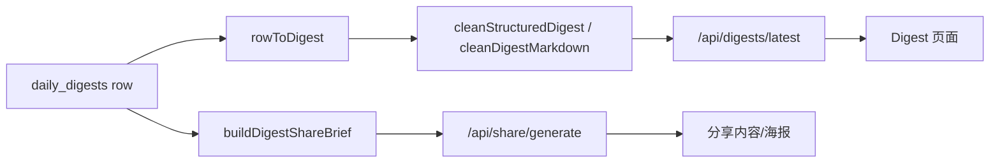

# SDD：Digest 与分享海报可信度回归

日期：2026-06-02

## 架构影响

本次在现有 Digest 清洗层上做小范围加固：

- `app/src/lib/digest-clean.ts` 新增 `buildDigestShareBrief`。
- `app/src/app/api/share/generate/route.ts` 使用 brief 构造分享源内容。
- `app/src/app/api/user/profile/route.ts` 新增兼容用户信息接口。
- `app/scripts/harness-digest-clean.mjs` 增加分享 brief 回归断言。

## 数据流

## 关键规则

- Digest API 继续在指定日期请求时返回 `Cache-Control: no-store`。
- 分享生成优先 structured digest，不直接把 `full_content` 原文塞给 LLM。
- fallback 只取清洗后的前 8 行，避免公众号尾巴和 RSS 噪音进入海报。
- `/api/user/profile` 与 `/api/settings` 返回同等用户设置字段，但保持未登录 401。

## 测试策略

- `npm run harness:digest` 校验 Mock/general/公众号尾巴清洗、structured digest 数量和 share brief 行数上限。
- `npm run build` 校验新增 API 路由参与 Next build。
- `npm run lint` 作为辅助检查；当前失败来自历史 React lint 债，单独记录。
- 本地浏览器打开 Digest 页面截图，记录 UI 可见证据。
