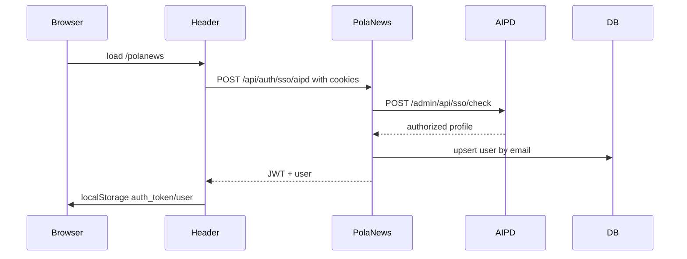

# SDD：AIPD SSO 与统一偏好同步

## 架构影响

| 模块 | 改动 | 说明 |
| --- | --- | --- |
| `app/src/lib/aipd-sso.ts` | 新增 | 封装 AIPD SSO check 和 preferences update，集中管理内部地址、app id、权限名。 |
| `app/src/app/api/auth/sso/aipd/route.ts` | 新增 | 将 AIPD session 转换为 PolaNews 本地 JWT。 |
| `app/src/components/layout/Header.tsx` | 修改 | 未登录时静默调用 SSO route，成功后写入本地登录态并触发 auth change。 |
| `app/src/app/api/settings/route.ts` | 修改 | 读取/保存时同步 AIPD 统一偏好。 |
| `app/src/lib/types.ts` | 修改 | 补充统一偏好字段类型。 |
| `app/src/app/settings/page.tsx` | 修改 | settings 数据结构接收统一偏好字段。 |

## 数据流

## 设计细节

- AIPD 调用集中在 `aipd-sso.ts`，避免 route 中散落硬编码。
- SSO route 不设置 Cookie，沿用现有 PolaNews 前端 localStorage token 模式，减少认证面变化。
- Settings 中统一偏好同步失败时返回本地默认值，不影响用户保存语言、分类和推送时间。
- 本地用户使用 AIPD 邮箱作为关联键，密码 hash 为空；普通密码登录仍按原逻辑校验。

## 测试策略

- 静态：`npx tsc --noEmit`。
- 相关 lint：`npx eslint src/lib/aipd-sso.ts src/app/api/auth/sso/aipd/route.ts src/app/api/settings/route.ts src/components/layout/Header.tsx src/app/settings/page.tsx src/lib/types.ts`。
- 回归：`npm run harness:feeds`、`npm run harness:digest`、`npm run deploy:doctor`。
- 线上：部署后检查 `supervisorctl status polanews`、首页 `200`、文章 API JSON success、无 cookie SSO 返回可控 401。

## 回滚

- 回滚 Git commit 并重新 build/restart `polanews`。
- 若只需临时停用统一偏好，可将 AIPD 内部服务设为不可达或移除 AIPD cookie；本地 JWT 登录不受影响。
