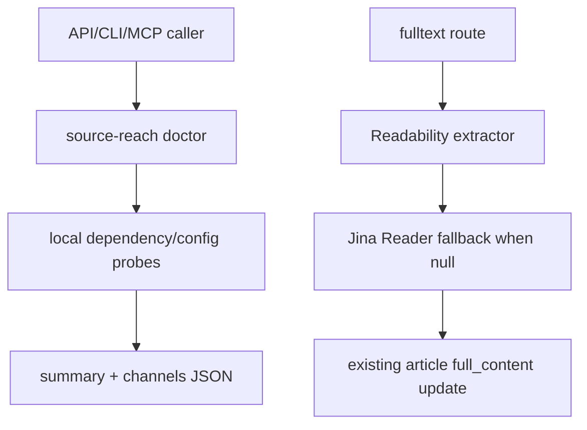

# SDD: PolaNews Agent Reach Source Harness

Date: 2026-07-02

## 1. Background and Target

Agent-Reach 的核心价值是“能力层/路由器”：先识别当前环境能用哪个上游工具，再让 Agent 或产品调用合适后端。PolaNews 需要类似机制支撑 RSS 之外的外部信号源，但不能把登录态抓取、社媒爬取或第三方 SDK 变成生产硬依赖。

## 2. Current System Understanding

| Dimension | Project Fact | Evidence | Impact |
| --- | --- | --- | --- |
| Production subproject | Current production implementation is under `app/` | `docs/pola/arch-reference.md` | New code should live under `app/` only. |
| API routes | Next API routes under `app/src/app/api/` return `{ success, data }` | `app/src/app/api/feeds/fetch/route.ts` | Source doctor should use the same envelope. |
| Fulltext | Article fulltext uses Readability + jsdom | `app/src/lib/services/readability.ts` | Add Jina fallback behind existing path. |
| CLI | `app/bin/polanews.mjs` routes commands to API | `app/bin/polanews.mjs` | Add a `source-reach` command without changing global runtime. |
| MCP | Tools are listed in `app/src/lib/mcp/server.ts` | `app/src/lib/mcp/server.ts` | Add one tool backed by the same core module. |

## 3. Project Arch Reference Summary

- arch-reference path: `docs/pola/arch-reference.md`
- Production code path: `app/`
- Reuse:
  - Next API route style from existing `/api/*/route.ts`.
  - CLI request helper in `app/bin/polanews.mjs`.
  - MCP tool list and `handleToolCall` switch.
  - Existing `fetchAndStoreFullContent` persistence path.
- Constraints:
  - Do not alter scheduler concurrency or RSS DB schema.
  - Do not print secrets.
  - Do not introduce production deployment changes.

## 4. Architecture Options

| Option | Consistency | Reuse | Coupling | Verification | Deployment Risk | Decision |
| --- | --- | --- | --- | --- | --- | --- |
| A: Import Agent-Reach package directly | Low | Low | High | Medium | High | Rejected |
| B: Implement small PolaNews-native source reach module | High | High | Low | High | Low | Selected |
| C: Only document recommendations | Low | None | Low | Low | Low | Rejected |

### Decision

Select option B. Implement a small local module inspired by Agent-Reach semantics: ordered backends, active backend, status classification and hints. This keeps PolaNews deployable without requiring Agent-Reach runtime or desktop/browser login tools.

Decision constraints:

- No DB writes in doctor.
- No raw secret values.
- No social/login scraping in this phase.
- Fulltext fallback must be best-effort and preserve old behavior on failure.

## 5. Module Impact

| Module | Change | Reason | Risk |
| --- | --- | --- | --- |
| `app/src/lib/source-reach/doctor.ts` | New doctor core | Shared API/MCP logic | Low |
| `app/src/app/api/source-reach/doctor/route.ts` | New API route | Operational entry | Low |
| `app/src/lib/services/readability.ts` | Add Jina fallback | Improve article fulltext resilience | P2 network risk, bounded by timeout |
| `app/bin/polanews.mjs` | Add CLI command | Agent/ops usage | Low |
| `app/src/lib/mcp/server.ts` | Add MCP tool | Agent integration | Low |
| `docs/pola/project-knowledge/delivery/...` | Add ledger/test matrix | A2A harness evidence | Low |

## 6. Data Flow

## 7. Interfaces

- `getSourceReachDoctor(options?: { live?: boolean }): Promise<SourceReachDoctorReport>`
- `GET /api/source-reach/doctor?live=false`
- CLI handler `handleSourceReach`
- MCP tool `source_reach_doctor`

## 8. Test Strategy

| Test Type | Command/Method | Coverage |
| --- | --- | --- |
| Static/build | `npm run lint` or `npm run build` under `app/` | A2-A4, A7 |
| CLI help | `node ./bin/polanews.mjs help` | A3 |
| API shape | TypeScript compile/build | A2 |
| Function matrix | `validate_function_test_cases.py` | A1, A6 |

## 9. Deployment and Rollback

Deployment: no production deployment in this task. Ship-ready only.

Rollback:

1. Remove `app/src/lib/source-reach/doctor.ts`.
2. Remove `app/src/app/api/source-reach/doctor/route.ts`.
3. Revert small edits in `readability.ts`, `polanews.mjs`, and `mcp/server.ts`.
4. Existing RSS, fulltext, Digest, CLI and MCP old commands remain usable.

## 10. Acceptance Mapping

| Acceptance | Implementation | Verification |
| --- | --- | --- |
| A1 | Docs and delivery files | File existence |
| A2 | API route and doctor module | Build/type/lint |
| A3 | CLI and MCP tool | CLI help/build |
| A4 | Jina fallback in readability | Unit by code path/build |
| A5 | Sanitized statuses only | Code review/diff scan |
| A6 | Test cases JSON | Harness validation |
| A7 | Additive route/commands only | Existing paths untouched |
