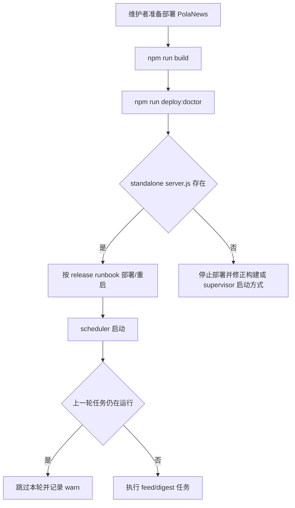
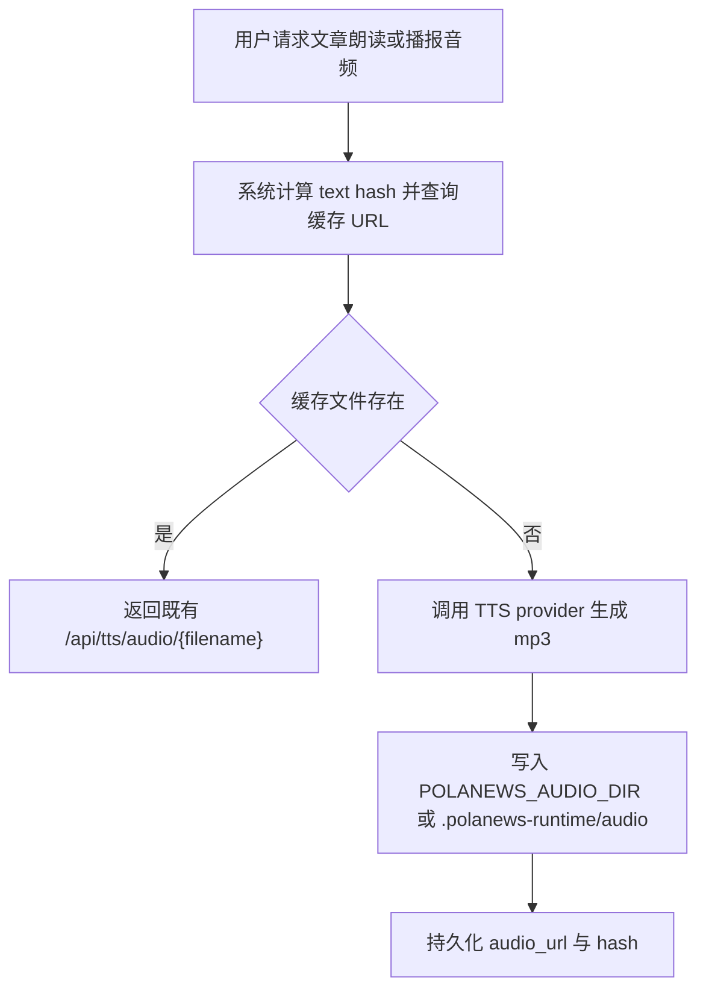

# PRD：PolaNews Scheduler 与部署启动护栏

## 背景

服务器诊断发现 PolaNews 生产 supervisor 因 `.next/standalone/server.js` 缺失进入 FATAL。代码扫描同时发现 scheduler 会在抓取后放飞翻译/分类任务，缺少运行锁和超时，可能在上一次任务未结束时继续叠加下一轮任务。`app` 生产构建还复现 Turbopack 对 `data/audio` 动态路径匹配 10208 个文件的 warning，说明 TTS 运行时缓存被纳入构建扫描。

## 目标

- 维护者在部署前能用 `npm run deploy:doctor` 发现 standalone 构建产物缺失。
- RSS/全文 ingest/Digest 定时任务不会重入。
- TTS 音频缓存不再默认位于 Next 项目构建根内，构建阶段不扫描海量 mp3 缓存。
- 根目录构建命令委托到生产 `app/` 子项目，避免误扫嵌套 `app/.next` 历史产物。
- 保持所有用户可见功能和 API 路径不变。

## 范围

- 修改 scheduler 运行方式：
  - 增加运行锁。
  - 增加超时。
  - 增加 scheduler 禁用开关。
  - 不再放飞翻译/分类任务。
- 新增部署 doctor：
  - 检查 Next.js config。
  - 检查 `.next/standalone/server.js`。
  - 检查 `.next/static`。
- 调整 TTS 音频缓存目录：
  - 默认目录改为项目根的 `.polanews-runtime/audio`，位于 `app` 构建根外。
  - 支持 `POLANEWS_AUDIO_DIR` 覆盖，便于生产指向稳定持久化目录。
  - 统一缓存存在性检查，避免路由层直接拼接 `data/audio` 动态路径。
- 调整根目录 npm scripts：
  - `build`、`dev`、`start`、`lint`、`deploy:doctor` 均委托到 `app/` 子项目。
  - 保留 root `package.json` 作为工作区入口，避免根目录 `next build` 误处理历史结构。
- 增加项目文档和测试记录。

## 非目标

- 不修改 Digest 页面。
- 不改数据库 schema。
- 不修改 nginx/supervisor 生产配置。
- 不做目录结构收敛。
- 不调整 RSS feed 内容策略。
- 不自动搬迁生产旧音频文件；迁移或环境变量配置在发布阶段处理。

## 用户流程

## 音频缓存运行时流程

## 不影响功能使用

- 首页、文章详情、Digest、Broadcast、Share、Subscriptions、Auth 路由不变。
- API 响应结构不变。
- 音频 URL 路径仍为 `/api/tts/audio/{filename}`，只改变服务器磁盘缓存位置。
- 定时任务只是从“可重入”变为“上一轮未结束时跳过下一轮”，不会删除任务能力。
- 生产紧急情况下可用 `POLANEWS_SCHEDULER_DISABLED=1` 暂停 scheduler，但这需要明确配置动作。

## 验收标准

- A1 `npm run build` 通过。
- A2 `npm run deploy:doctor` 在构建后通过。
- A3 `npm run harness:digest` 通过。
- A4 `git diff --check` 通过。
- A5 构建日志不再出现 `data/audio` 动态路径匹配 10208 个文件的 Turbopack warning。
- A6 根目录 `npm run build` 通过，并等价于 `npm --prefix app run build`。
- A7 未修改既有脏文件 `src/app/digest/[date]/page.tsx`。
