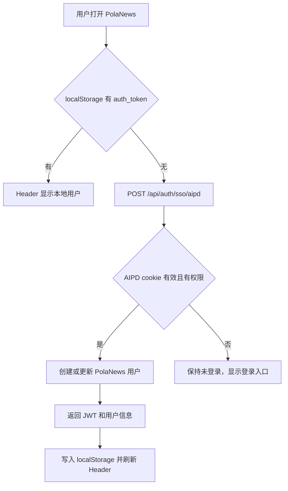

# PRD：AIPD SSO 与统一偏好同步

## 背景

PolaNews 已接入 AIPD 统一账号体系的线上热修，但代码未进入 GitHub 主线。该状态会让服务器和本地仓库长期漂移，也会导致后续部署可能覆盖线上登录体验。因此本次把热修转成正式实现。

## 用户故事

- 作为已登录 AIPD 的用户，我打开 `/polanews` 时不需要再次输入 PolaNews 账号，即可获得本地登录态。
- 作为登录用户，我希望右上角始终显示我的昵称或邮箱，而不是只有图标。
- 作为用户，我在设置页修改主题等体验偏好后，希望这些偏好能跟随 AIPD 统一账号。
- 作为维护者，我希望 AIPD 服务地址和权限名可以通过环境变量调整，而不是散落硬编码。

## 交互流程

## API 行为

### `POST /api/auth/sso/aipd`

- 输入：浏览器携带的 AIPD cookie。
- 处理：
  - 调用 AIPD 内部 `POST /admin/api/sso/check`。
  - 校验 `app_id=PolaNews` 和 `permission=polanews.use`。
  - 若本地用户不存在，则按邮箱创建用户。
  - 若存在，则更新昵称、头像和 `last_login_at`。
- 输出：`{ success, data: { user, token } }`。

### `GET /api/settings`

- 仍要求 PolaNews JWT。
- 返回本地语言/Digest/分类偏好。
- `theme/font_family/font_scale/density` 优先取 AIPD 统一偏好，缺失时回退本地偏好和默认值。

### `PUT /api/settings`

- 仍保存本地资料、语言、Digest 时间、分类。
- `theme/font_family/font_scale/density` 同步到 AIPD `POST /admin/api/preferences`。
- AIPD 不可达时不阻断本地偏好保存。

## 配置

- `AIPD_INTERNAL_BASE_URL`：默认 `http://127.0.0.1:5000`。
- `AIPD_APP_ID`：默认 `PolaNews`。
- `AIPD_PERMISSION`：默认 `polanews.use`。

## 验收

- Header 未登录时会自动尝试 SSO。
- 无 AIPD cookie 时不会报错，只保留登录按钮。
- Settings 可继续保存本地字段。
- TypeScript 和相关 lint 通过。
