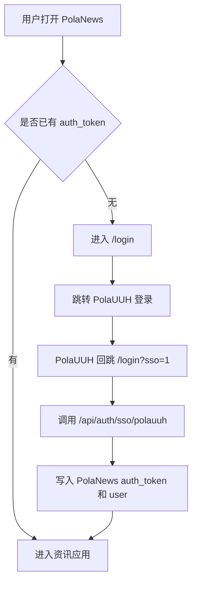

# PRD: PolaNews 统一账号入口

日期：2026-06-11

## 用户流程

## 规则

- PolaUUH 是唯一默认注册/登录入口。
- 线上默认路径：
  - 登录：`https://aipd.me/PolaUUH/admin/login`
  - 注册：`https://aipd.me/PolaUUH/admin/register`
  - SSO：`https://aipd.me/PolaUUH/admin/api/sso/check`
- PolaNews 业务偏好仍保留在 PolaNews。
- AIPD 命名接口保留为兼容层，不再作为新代码主路径。
- `next` 回跳必须是站内绝对路径，避免开放跳转。
