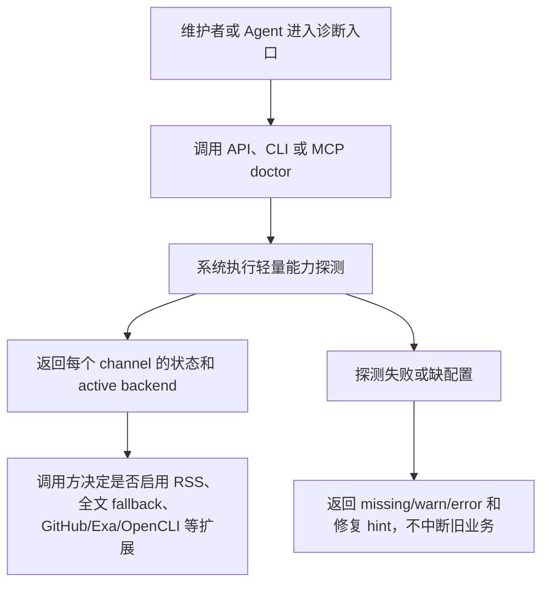

# PRD: PolaNews Source Reach Harness

Date: 2026-07-02

## Product Goal

让 PolaNews 从单纯 RSS 聚合进一步具备“外部信息源能力雷达”：系统能清楚知道当前环境能用哪些来源、哪个后端正在生效、哪些来源需要配置、哪些来源因风险被关闭。

## User Flow

## Entry Points

- API: `GET /api/source-reach/doctor`
- CLI: `polanews source-reach doctor`
- MCP: `source_reach_doctor`
- Existing fulltext route: `GET/POST /api/articles/{id}/fulltext`

## Functional Behavior

- Doctor returns a deterministic channel list:
  - `rss`: built-in RSS parser and current feed pipeline.
  - `readability`: local Readability + jsdom extraction.
  - `jina_reader`: optional web article fallback.
  - `github`: optional `gh` CLI capability.
  - `exa`: optional `EXA_API_KEY`/MCP style capability.
  - `opencli`: optional desktop/browser mediated capability, disabled by default for production use.
- Each channel includes:
  - `status`: `ok`, `warn`, `off`, or `error`.
  - `backends`: ordered backend list.
  - `active_backend`: active backend or null.
  - `risk_tier`: P3/P2/P1 style risk label.
  - `requires_config` and `requires_login`.
  - `hint` with non-sensitive remediation.
- Fulltext fallback:
  - Try existing Readability path first.
  - If it returns null, try Jina Reader for public HTTP/HTTPS URLs.
  - If fallback succeeds, store content through the existing `fetchAndStoreFullContent` path.

## UI/Layout

No new visual page in this phase. The feature is operational/API first. Future UI may add a settings diagnostics panel, but this delivery only needs machine-readable outputs.

## Empty and Error States

- Missing optional tools return `off`, not HTTP 500.
- Broken commands return `error` with reinstall/action hint.
- Live probe timeout returns `warn` or `error` for that channel only.
- Unsupported/private URLs are skipped by Jina fallback and leave existing fulltext behavior intact.

## Compatibility

- Existing API envelopes keep `{ success, data }`.
- Existing CLI commands remain unchanged.
- Existing MCP tool names keep their current semantics.
- RSS scheduler and ingest concurrency are not modified.

## Acceptance Mapping

| Acceptance | Product Evidence |
| --- | --- |
| A1 | PRD/SPEC/SDD/devlog/delivery files |
| A2 | `/api/source-reach/doctor` |
| A3 | CLI and MCP additions |
| A4 | `readability.ts` Jina fallback |
| A5 | No secret values in output, no DB writes in doctor |
| A6 | Test matrix and validation commands |
| A7 | Existing route/CLI/MCP paths unchanged |
